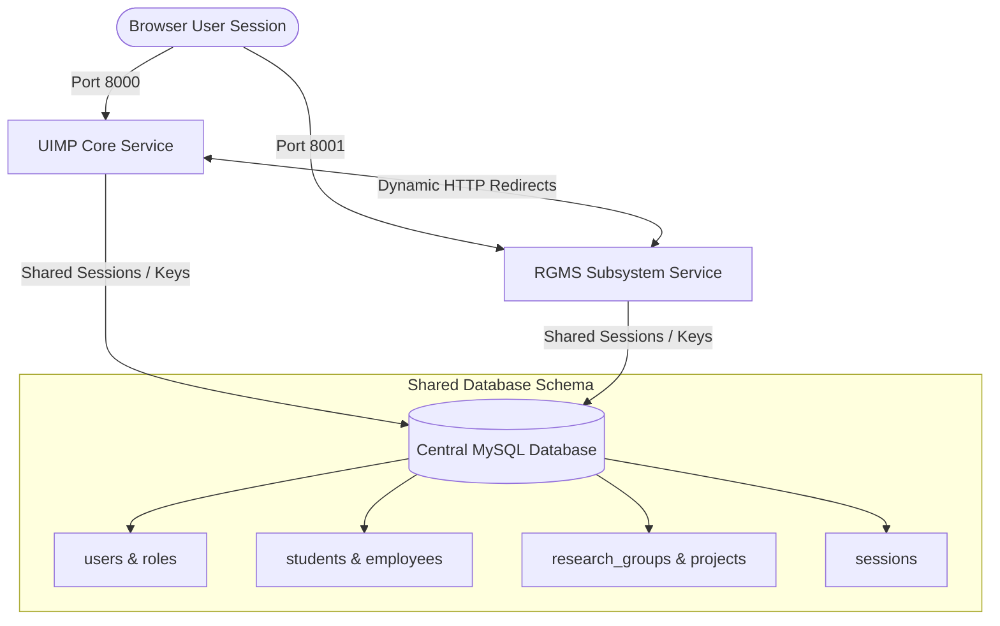

# Software Design Document (SDD)
## Unified University Information Management Platform (UIMP) + Research Groups Management Subsystem (RGMS)
### Decoupled Subsystem Architecture

---

## 1. System Overview & Objectives
The platform is designed to govern core university administration and scientific research activities under a decoupled architecture. The codebase is separated into two independent Laravel applications:

1. **UIMP Core (`uimp-core` @ port 8000)**: Serves as the central directory for students, employees, facilities, roles management, and compliance audit logs.
2. **RGMS Subsystem (`rgms-subsystem` @ port 8001)**: Governs research groups, scientific projects, budgets, deliverables, research equipment, and academic publications.

Both systems operate independently, sharing a centralized database schema for dynamic resource mapping and Single Sign-On (SSO) session synchronization.

---

## 2. Architecture Design
The architecture is structured as a **Decoupled Monolith with Shared Session State**.



### 2.1 Single Sign-On (SSO) Mechanics
- **Shared Encryption Key**: Both applications share the same `APP_KEY` inside their `.env` files to encrypt and decrypt cookies.
- **Shared Session Table**: Both use `SESSION_DRIVER=database` mapping to the same `sessions` database table.
- **Cookie Lifetime**: Session state is persisted across ports `8000` and `8001` via the browser's shared cookie scope for the local domain.

---

## 3. Database Schema & Data Dictionary

### 3.1 Core User Directory (`users` table)
Stores credential and security metadata for system authentication.

| Column | Type | Nullable | Description |
|---|---|---|---|
| `id` | UUID (PK) | No | Unique user identifier. |
| `username` | String | No | Unique login username. |
| `email` | String | No | Unique contact email. |
| `password_hash` | String | No | BCRYPT-encrypted password hash. |
| `is_active` | Boolean | No | Account status (Active/Suspended). |
| `failed_login_count` | SmallInt | No | Consecutive failed login attempts (max 5). |
| `locked_until` | Timestamp | Yes | Lockout timestamp for brute-force prevention. |

### 3.2 Student Registry (`students` table)
Governs academic enrollments and registration status.

| Column | Type | Nullable | Description |
|---|---|---|---|
| `id` | UUID (PK) | No | Primary key. |
| `institutional_id` | String | No | Unique University student card ID. |
| `name_ar` | String | No | Student name in Arabic. |
| `name_en` | String | No | Student name in English. |
| `enrollment_status` | Enum | No | `ACTIVE`, `SUSPENDED`, `GRADUATED`, `UNDER_REVIEW` |

### 3.3 Research Groups Registry (`research_groups` table)
Governs active university research groups.

| Column | Type | Nullable | Description |
|---|---|---|---|
| `id` | UUID (PK) | No | Unique identifier. |
| `name_ar` | String | No | Group name in Arabic. |
| `name_en` | String | No | Group name in English. |
| `code` | String | No | Unique research group code. |
| `primary_discipline`| String | No | Main field of research. |

### 3.4 Group Memberships (`group_memberships` table)
Maps students or staff to research groups with designated roles and workloads.

| Column | Type | Nullable | Description |
|---|---|---|---|
| `id` | UUID (PK) | No | Primary key. |
| `group_id` | UUID (FK) | No | References `research_groups.id`. |
| `member_uimp_id` | UUID (FK) | No | References the member in core student/staff registries. |
| `member_type` | Enum | No | `Staff`, `Student`, `External` |
| `role` | Enum | No | `PI`, `Co-I`, `Research-Assistant`, `Graduate-Researcher` |
| `workload_percentage`| Int | No | Allocation workload (must not exceed 100% total). |

---

## 4. Security & Role-Based Access Control (RBAC)

The system restricts routes using Spatie RBAC middleware. The following boundaries are enforced:

1. **System Administration (`SYSTEM_ADMIN`, `UNIVERSITY_ADMIN`)**:
   - Access to all core entities, user accounts creation, dynamic role allocation, and audit logs.
2. **Registrar Staff (`REGISTRAR`)**:
   - Authorized to manage student profiles, programs, and enrollment states in `uimp-core`.
   - **Blocked** from accessing the `rgms-subsystem`.
3. **HR Staff (`HR_STAFF`)**:
   - Authorized to manage employee rosters, structures, and departments.
   - **Blocked** from accessing the `rgms-subsystem`.
4. **Academic Researchers (`FACULTY`, `STUDENT`)**:
   - Access to research group registrations, milestone trackers, and publication rosters inside `rgms-subsystem`.

---

## 5. Audit Log Immutability Constraint
For academic and administrative compliance, Audit Logs inside the database are **strictly read-only (immutable)**:
- **Application Level**: No controller or routing path exists for editing or deleting records inside the `audit_logs` model.
- **Database Level**: SQL triggers block modification on the `audit_logs` table:
```sql
CREATE TRIGGER prevent_audit_log_updates
BEFORE UPDATE ON audit_logs
FOR EACH ROW
BEGIN
    SIGNAL SQLSTATE '45000' SET MESSAGE_TEXT = 'Audit logs are strictly immutable and cannot be updated.';
END;
```

---

## 6. API Interface Specifications

### 6.1 Get Active Research Groups
- **Endpoint**: `GET /api/v1/rgms/research-groups`
- **Headers**:
  - `Authorization: Bearer <token>`
- **Response (200 OK)**:
```json
{
  "success": true,
  "data": [
    {
      "id": "9a38bd20-3058-45fa-b648-912f205ab090",
      "name_ar": "مجموعة الذكاء الاصطناعي",
      "name_en": "Artificial Intelligence Group",
      "code": "AI-RG-01",
      "primary_discipline": "Computer Science"
    }
  ]
}
```

### 6.2 Create User Account
- **Endpoint**: `POST /api/v1/auth/users/create` (SYSTEM_ADMIN only)
- **Request Body**:
```json
{
  "username": "faculty02",
  "email": "faculty02@uimp.edu.ly",
  "password": "securepassword123",
  "role": "FACULTY"
}
```
- **Response (201 Created)**:
```json
{
  "success": true,
  "message": "User account created successfully."
}
```
